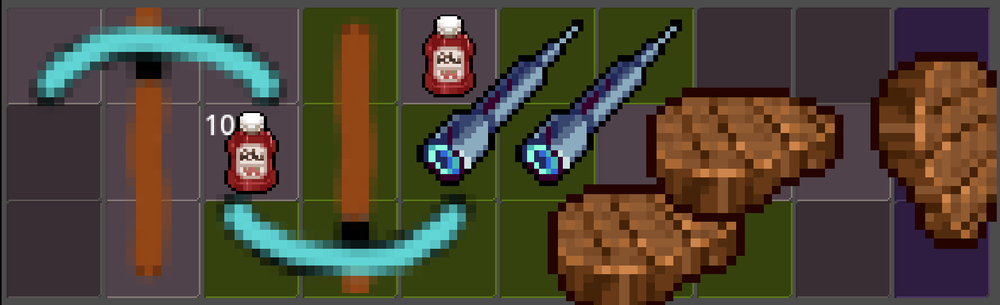

# Grid Inventory System with Custom Patterns for Godot 4

---

## **Project Overview**

This project implements a grid-based inventory system as seen in inventory management games using **Godot 4**, with features such as:

- **Customizable Item Patterns:** Items can have varying shapes defined by patterns.
- **Rotatable Items:** Items can rotate to fit within the grid.
- **Item Stacking and Merging:** Supports stacking of items and merging items with specific conditions.
- **Dynamic Inventory Grid:** Fully scalable and customizable inventory grid.
- **Inventory Save/Load Support:** States of the inventory and items can be saved and reloaded.
- **Item Rarity System:** Different rarities with associated probabilities and visual indicators.
- **Interactive Inventory:** Drag-and-drop functionality for item placement and repositioning.



---

## **How to Use**

### **Setup**
1. Include the `apeloot` folder in your addons directory, or download it from asset library.
2. Attach `inventory_interface.gd` to a `PanelContainer` node in your scene. This node represents the inventory grid. You can also drag and drop `inventory_interface.tscn` to your scene.

---

### **Features**
#### **Item Definitions**
Define items in `Apeloot.gd` under the `items` dictionary:
```gdscript
const items := {
	"steak": {
		"name": "Steak",
		"desc": "Made from happy cows.",
		"price": 31,
		"rarity": Rarity.COMMON,
		"pattern": "3x1",
		"merge": true,
	}
}
```
- **name:** Display name.
- **desc:** Description.
- **price:** Price of the item.
- **rarity:** Rarity of the item (e.g., COMMON, UNCOMMON). Used for merging.
- **pattern:** The shape/pattern of the item on the grid (refer to `item_patterns`).
- **merge:** Whether the item can merge with another of the same type.
- **stack:** Maximum stack count for item, accepts int.

#### **Grid Configuration**
`inventory_interface.gd` allows customization:
- `id`: This is identifier for the inventory, should be unique.
- `slot_count`: Total number of slots in the inventory.
- `columns`: Number of columns in the grid.
- `single_slot`: Restrict items to single-slot grids.
- `pickup_only`: Disable item placement; inventory becomes read-only.
- `slot_background`: Texture for slot backgrounds.
- `slot_separation`: Defines spacing between slots.

---

### **API Reference**

#### **Signals**
- `item_placed(item: DraggableItem)`: Fired when an item is placed in the inventory.
- `item_removed(item: DraggableItem)`: Fired when an item is removed.
- `item_updated(item: DraggableItem)`: Fired when an item's state changes.

#### **Functions**
1. **`initialize_inventory(states: Array = item_states)`**
   - Initializes the inventory with predefined states.
   - Parameters:
	 - `states` (optional): Array of saved states to load.

2. **`load_inventory(data: Dictionary)`**
   - Loads inventory from a saved dictionary.
   - Parameters:
	 - `data`: Dictionary containing inventory data.

3. **`try_fit_and_place(item: DraggableItem) -> bool`**
   - Attempts to fit and place an item in the inventory.
   - Returns `true` if successful.

4. **`remove_item(item: DraggableItem)`**
   - Removes a specified item from the inventory.

5. **`find_valid_slot(item: DraggableItem) -> int`**
   - Finds the first valid slot where an item can fit.
   - Returns the slot index or `-1` if no slot is valid.

6. **`get_item_at_slot(slot_id: int) -> DraggableItem`**
   - Retrieves the item at a specified slot index.

7. **`reconstruct_grid_from_states(saved_states: Array)`**
   - Reconstructs the grid layout from saved item states.

8. **`get_occupied_slots(item: DraggableItem, center_slot_id: int) -> Array`**
   - Returns a list of slots occupied by an item based on its center position.

---

### **Example Usage**

You can also refer to `example.tscn` for example usages.

#### **Adding Items**
```gdscript
var item = inventory.spawn_item("steak")
if inventory.can_place_item(item, target_slot):
	inventory.snap_item_to_grid(item, target_slot)
else:
	item.queue_free()  # Cleanup if placement fails
```

#### **Loading Inventory**
```gdscript
var saved_inventory = {
	"inventories": {
		"main_inventory": [
			{"id": "steak", "stack_count": 1, "previous_center_slot": 5}
		]
	}
}
inventory.load_inventory(saved_inventory)
```

#### **Saving Inventory**
```gdscript
var saved_states = inventory.item_states
# Save `saved_states` externally
```

---

### **Item Patterns**
Patterns define item shapes on the grid. Use square matrices, 1 defines occupied slots.

Examples:
```gdscript
const item_patterns = {
	"1x1": [[1]],
	"2x2": [
		[1, 1],
		[1, 1]
	],
	"T": [
		[1, 1, 1],
		[0, 1, 0],
		[0, 1, 0]
	]
}
```

---

### **Future Enhancements**
- **Advanced Sorting:** Organize items by type, rarity, or other attributes.
- **Multiplayer Synchronization:** Real-time inventory updates across networked instances.
- **Drag-and-Drop UI Refinements:** Enhanced visual cues during item interactions.

---
